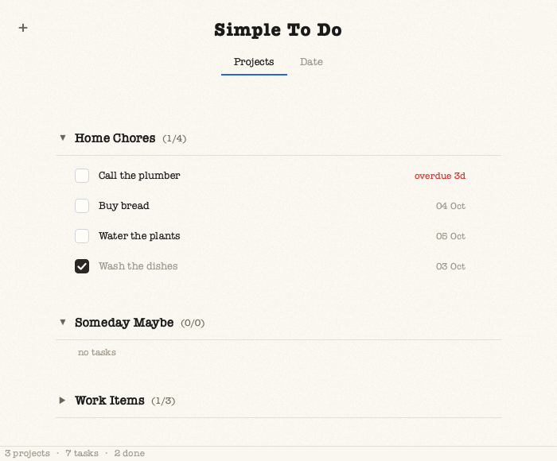

# SimpleTodo

A minimalist to-do app for macOS and Ubuntu. It works entirely offline: no
accounts, no network calls, no telemetry. Your tasks are stored in one SQLite
file on your own disk.



## Download (macOS, Apple Silicon)

Download `SimpleTodo-1.0.0-macos-arm64.zip` from the
[latest release](https://github.com/boredtoolbox/simpletodo/releases/latest),
unzip it, and drag `SimpleTodo.app` into Applications. The app is unsigned, so
the first time you open it, right-click it and choose **Open**. If macOS still
blocks it, go to System Settings → Privacy & Security and click **Open Anyway**.

## Run from source (macOS and Ubuntu)

You need Python 3.10 or newer.

```bash
git clone https://github.com/boredtoolbox/simpletodo.git
cd simpletodo
python3 -m venv .venv
.venv/bin/python -m pip install -r requirements.txt
.venv/bin/python run.py
```

The only dependency is PySide6 (Qt 6).

If pip says it "can not perform a '--user' install", run the install line as
`PIP_USER=0 .venv/bin/python -m pip install -r requirements.txt`.

### macOS app (optional)

To build a double-clickable `SimpleTodo.app`:

```bash
.venv/bin/python -m pip install -r requirements-build.txt
.venv/bin/python -m PyInstaller packaging/SimpleTodo.spec --noconfirm
```

Then drag `dist/SimpleTodo.app` into Applications. The app is unsigned, so the
first time you open it, right-click it and choose **Open**.

## Using it

- **+** (top left) creates a project or a task.
- **Projects** tab: click a project to expand it. Tick a checkbox to complete a
  task, and click a task's name to read its description.
- **Date** tab: tasks are grouped into Today, Tomorrow, This Week and Rest.
  Overdue tasks show up in Today, in red.
- Hover a project or task and click **⋯** (or right-click it) to rename,
  delete or archive it. The box button under **+** opens the archive, where
  you can restore projects.

## Your data

| Platform | Location |
| --- | --- |
| macOS | `~/Library/Application Support/simpletodo/todo.sqlite3` |
| Linux | `~/.local/share/simpletodo/todo.sqlite3` (respects `$XDG_DATA_HOME`) |

To store it somewhere else, set `SIMPLETODO_DATA_DIR`. Every change is saved
immediately. If the file is ever damaged, the app keeps a backup copy
(`todo.sqlite3.corrupt-<timestamp>`) and starts a fresh database.

## Development

```bash
.venv/bin/python -m pytest
```
